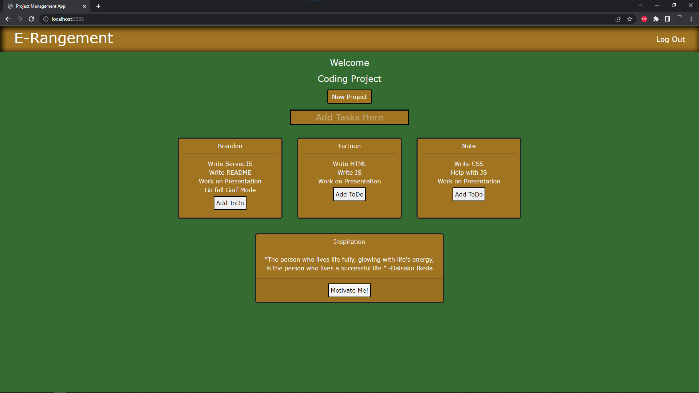

# E-Rangement Project Management Application

## USER STORY
```
AS as user I wish to help stay organized
WHEN I login I am welcomed by application
THEN I am allowed to create a new project
IF other users have also signed up you may collaborate with them and assign them tasks
IF I am feeling down or not motivated, I am able to generate an inspirational quote
WHEN finished I close the application and continue about my day
```

## Description of our application
Our application helps the every day user who may be a...little scatter brained or just need a visual representation for things they need to get done! We allow the user to log-in and save their information (securely so that the user knows their information is safe.) Once the user is logged in they are presented with several buttons. The first button allows them to name whatever project they are working on, whether that be a coding assignment or even as simple as cleaning the house. Below that is a input bar where they can enter tasks that need to get done for whatever project they are working on and they can assign them to themselves OR other users that are collaborating with them on the project. At the bottom of the screen there is a button that generates inspirational quotes and motivates the user to complete whatever task they are working on.

## Languages used
This application was made using CSS with some help from Bootstrap, as well both front end and back end Javascript. Our HTML was all generated through the use of Handlebars which showed users different views of the application based on whether they were logged in or not.

## Meet the Development team!
This application was developed by the following users. Please checkout some of their other work on their Github links below!

* Fartuun Ali - https://github.com/afartuun
* Nate Brengman - https://github.com/NateB98
* Brandon Langer - https://github.com/Minotaurius

## Demo of application
(https://www.youtube.com/watch?v=4Z8m-eynOVM)

## Screenshot showing application


## Deployed link to application
Click [HERE](https://erangement-project-management.herokuapp.com/) to begin your own Project Management via E-Rangement (Hosted by Heroku!)

## Link to Repository storing our code
* https://github.com/Minotaurius/E-Rangement_Project_Management
